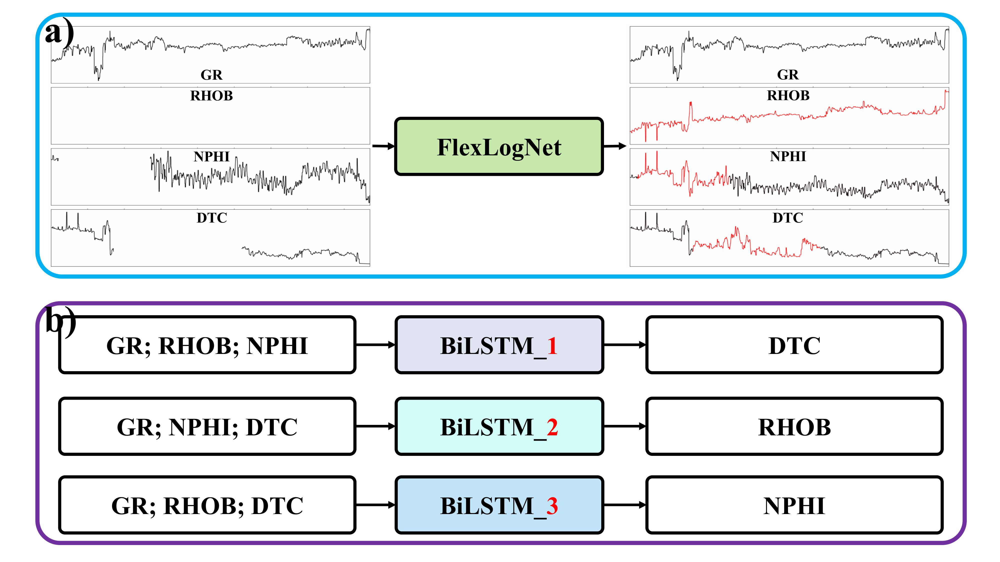

<p align="center" width="100%">

</p>


<div>
<div align="center">
    <strong>FlexLogNet: A flexible deep learning-based well-log completion method of adaptively using 
        </br>
        what you have to predict what you are missing</strong>
    </br>
    <a href='https://github.com/Jokercldai/' target='_blank'>Chuanli Dai<sup>1</sup></a>&emsp;
    <a href='http://cig.ustc.edu.cn/people/list.htm' target='_blank'>Xu Si<sup>1</sup></a>&emsp;
    <a href='http://cig.ustc.edu.cn/people/list.htm' target='_blank'>Xinming  Wu<sup>1,*</sup></a>&emsp;
</div>
<div>

<div align="center">
    <sup>1</sup>
    University of Science and Technology of China&emsp;
    </br>
    <!-- <sup>*</sup> Equal Contribution&emsp; -->
    <sup>*</sup> Corresponding Author&emsp;
</div>

-----------------

# 🌟 FlexLogNet
As shown in above figure, our network takes multiple types of well logs as input from which the network leverages all available well log segments to predict the missing ones at the same depth.

The advantage of our method lies in the fact that it can adaptively use all known well logs to predict any missing well logs, achieving a very flexible and practical well log completion function of using what you have to complete what you are missing. It overcomes the limitations of models like BiLSTM, which are fixed in terms of input and output well log types and are unable to complete randomly missing well logs in practical scenarios or require multiple models to predict specific types of missing logs separately.

<p align="center" width="100%">

</p>

We have innovatively coupled a heterogeneous graph neural network into the U-Net architecture. Specifically, during the downsampling process, we use multiple independent CNN encoders to better extract the spatial features of each corresponding log separately, instead of using a single encoder for all logs. During the upsampling process, we introduce a heterogeneous aggregation module and adapt and optimize the attention mechanism calculation for the well log task.

<p align="center" width="100%">

</p>

If our work has been helpful to you, please refer and cite the following articles: 
[FlexLogNet](https://www.sciencedirect.com/science/article/abs/pii/S0098300424001493)

```
@article{DAI2024105666,
title = {FlexLogNet: A flexible deep learning-based well-log completion method of adaptively using what you have to predict what you are missing},
journal = {Computers & Geosciences},
volume = {191},
pages = {105666},
year = {2024},
issn = {0098-3004},
doi = {https://doi.org/10.1016/j.cageo.2024.105666},
url = {https://www.sciencedirect.com/science/article/pii/S0098300424001493},
author = {Chuanli Dai and Xu Si and Xinming Wu},
keywords = {Missing well logs, Well log completion, FlexLogNet, The HGNN head, The FCN head},
}
```

# 🌟 Quick start

## Installation
Our work is primarily based on the implementation of graph neural network architectures, relying on the Python language and the torch-geometric library (version 1.5 and above). The specific installation steps for torch-geometric are as follows:
[torch-geometric](https://pytorch-geometric.readthedocs.io/en/latest/install/installation.html)

## file 


