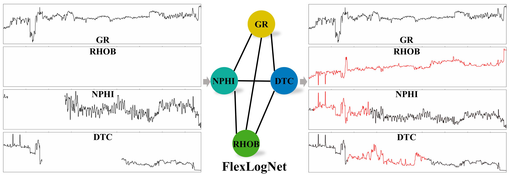

    FlexLogNet: A flexible deep learning-based well-log completion method of adaptively using what you have to predict what you are missing&emsp;
     
    <a href='https://github.com/Jokercldai/' target='_blank'>Chuanli Dai1</a>&emsp;
    <a href='http://cig.ustc.edu.cn/people/list.htm' target='_blank'>Xu Si1</a>&emsp;
    <a href='http://cig.ustc.edu.cn/people/list.htm' target='_blank'>Xinming  Wu1,†</a>&emsp;

    1
    University of Science and Technology of China&emsp;
     
    <!-- * Equal Contribution&emsp; -->
    † Corresponding Author&emsp;

-----------------
